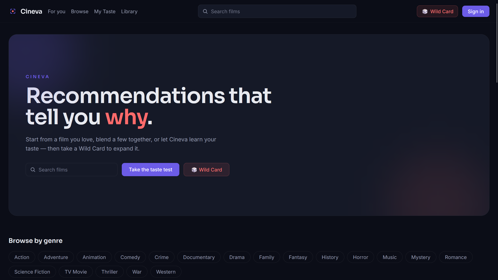
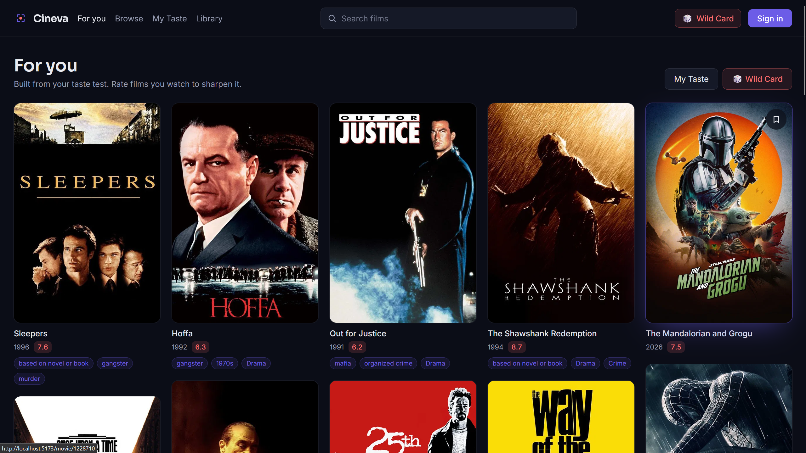
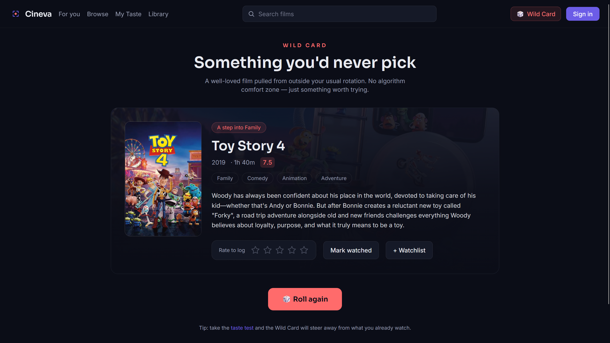
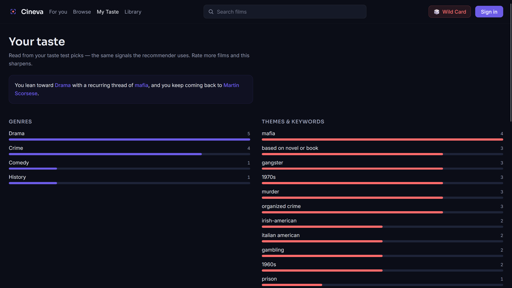

<div align="center">

# Cineva

**Film recommendations that tell you _why_.**

Start from a film you love, a set of films, or your own viewing history —
and get recommendations that explain themselves. Then hit the Wild Card for
something deliberately outside your comfort zone.

[](https://react.dev)
[](https://www.typescriptlang.org)
[](https://vitejs.dev)
[](https://tailwindcss.com)
[](https://supabase.com)
[](#license)

</div>

---

## Screenshots

<!--
  Add screenshots here — this is the first thing anyone looks at.
  1. Create a `docs/` folder and drop your images in it.
  2. Replace the paths below.
  Good ones to capture: the home page, a recommendation grid with the "why" chips,
  the Wild Card, My Taste, and a movie detail page.
-->

| Home | Recommendations |
|---|---|
|  |  |

| Wild Card | My Taste |
|---|---|
|  |  |

## Why this exists

Streaming services recommend films from a black box: you get a row of posters and
no idea why. Cineva does the opposite — every recommendation shows the actual
reasons it surfaced, whether that's a shared director, a recurring theme, or an
actor you keep coming back to.

It also solves the other half of the problem. A recommender that only shows you
more of what you already like is a comfort trap, so Cineva ships a **Wild Card**:
a quality-gated pick chosen from *outside* your usual genres, designed to widen
your taste rather than confirm it.

## Features

**Discovery**
- Full-text film search backed by TMDB
- Rich detail pages — backdrop, cast, trailer, genres, keywords, similar films
- Browse by genre with sorting and minimum-rating filters, infinite scroll

**Recommendations**
- **Explainable results** — every recommendation carries chips naming why it matched
- Three ways in: a single film, a set of films blended together, or your accumulated taste
- **"For you" feed** — a masonry, infinitely-scrolling feed that sharpens as you rate
- **Wild Card** — a random, quality-gated film outside your usual genres, with reroll
- **My Taste** — a visualization of the profile the engine inferred about you

**Your library**
- Log films as watched with a 1–5 star rating; build a watchlist
- **Works without an account** — guests are stored in-browser and migrated on sign-up
- **Letterboxd import** — bring your entire watch history across via your own data export

**Accounts**
- Email + password auth, password reset, unique usernames
- Public profile with banner, avatar, bio, and stats
- Settings for profile, images, data import, and account controls

**Practical**
- **Where to watch** — streaming, rental, and purchase availability by country
- Responsive from mobile to desktop, dark by design
- Loading, empty, and error states on every data view; reduced-motion support

## How the recommender works

A content-based engine that runs client-side. No training, no cold-start problem,
and — crucially — a score that can be decomposed back into human-readable reasons.

```
Taste input (a film · a set of films · your rated history)
  → Candidate generation   TMDB similar/recommended + a discover sweep of your top genres
  → Feature extraction     genres · keywords · top cast · directors · era
  → Similarity scoring     weighted trait overlap, keywords weighted highest
  → Personalisation        boost traits you favour, drop films you've seen
  → Ranked results + the reasons behind each one
```

**Why keywords carry the most weight:** genres are too coarse to separate two very
different thrillers, while TMDB's keywords (`dystopia`, `heist`, `slow burn`)
capture what a film is actually *like*. Directors and cast come next, then genre
and era, with a small nudge toward well-regarded films to break ties.

**Why repetition matters:** a trait shared across several of your films outweighs
a one-off, so the more your picks agree, the sharper the results. Films rated 5★
count double.

**Because the score is a sum of named contributions**, the top contributors become
the explanation — the "why" is a by-product of the design, not a separate feature
bolted on afterwards.

**The Wild Card inverts this.** It samples a random genre you *don't* usually
watch, filters to films with a strong rating and enough votes so a surprise is
never a dud, excludes anything you've logged, and retries rather than repeating
itself.

## Tech stack

| Layer | Choice | Why |
|---|---|---|
| Frontend | React 18 + TypeScript + Vite | Fast dev loop, type safety end to end |
| Styling | Tailwind CSS | Design tokens in config, no CSS drift |
| Server state | TanStack Query | Caching, retries, and loading/error states for free |
| Routing | React Router | Standard, nothing exotic needed |
| Film data | TMDB API | Best free catalogue — posters, keywords, credits, providers |
| API key safety | Serverless proxy | The TMDB key never reaches the browser |
| Accounts | Supabase (Postgres + Auth + Storage) | Real SQL and row-level security without hand-rolling auth |
| Hosting | Vercel | Frontend and serverless functions deploy together |

Five runtime dependencies in total. The CSV parser, similarity scoring, and taste
aggregation are written from scratch rather than pulled in.

## Getting started

### Prerequisites

- [Node.js](https://nodejs.org) 18 or newer
- A free [TMDB API key](https://www.themoviedb.org/settings/api) (v3 auth)
- A free [Supabase](https://supabase.com) project — optional; the app runs without
  one, guests just keep their data in-browser

### 1. Install

```bash
git clone https://github.com/x87d/cineva.git
cd cineva
npm install
```

### 2. Configure

Copy the example env file and fill in your own values:

```bash
cp .env.example .env
```

| Variable | Required | Notes |
|---|---|---|
| `TMDB_API_KEY` | Yes | **Server-side only** — never prefixed with `VITE_`, never shipped to the browser |
| `VITE_SUPABASE_URL` | For accounts | Your project URL, e.g. `https://xxxx.supabase.co` |
| `VITE_SUPABASE_ANON_KEY` | For accounts | The **publishable** key. Safe in the browser — row-level security is what protects data |

> `.env` is git-ignored. Never commit real keys.

### 3. Set up the database (optional — only for accounts)

In your Supabase project, open **SQL Editor** and run, in order:

1. `supabase/schema.sql` — profiles, watched, watchlist, and row-level security
2. `supabase/schema-v2.sql` — usernames, bios, and the avatar/banner storage bucket

Then under **Authentication**:
- **Providers → Email**: turn *Confirm email* off for easy local testing
- **URL Configuration**: set the Site URL to `http://localhost:5173` and add
  `http://localhost:5173/reset-password` to Redirect URLs, so reset links work

### 4. Run

```bash
npm run dev
```

Open the printed URL. One command runs both the app and the local API proxy.

## Scripts

| Command | Does |
|---|---|
| `npm run dev` | Dev server + local `/api` proxy |
| `npm run build` | Type-check, then production build to `dist/` |
| `npm run typecheck` | Type-check app and API without building |
| `npm test` | Run the unit tests |
| `npm run preview` | Serve the production build locally |

## How the API proxy works

The browser only ever calls this app's own `/api/*` routes — never TMDB directly.

- **In development**, a small Vite plugin (`vite.config.ts`) serves the handlers in `api/`
- **In production**, Vercel runs those same files as serverless functions

Either way `TMDB_API_KEY` stays on the server. Search the built bundle and you
won't find it.

| Endpoint | Returns |
|---|---|
| `/api/trending` | This week's trending films |
| `/api/search?q=&year=` | Film search, optionally narrowed by year |
| `/api/movie?id=` | Full details — credits, keywords, videos, similar, watch providers |
| `/api/discover?…` | Filtered discovery (only whitelisted TMDB params are forwarded) |
| `/api/genres` | The genre list |

`/api/discover` forwards an explicit allow-list of parameters, so the proxy can't
be used as an open relay to TMDB.

## Importing from Letterboxd

Letterboxd's official API is application-only and currently excludes
recommendation and personal projects — so Cineva imports the user's **own data
export** instead. No API keys, no approval, and the person stays in control of
their data.

1. On Letterboxd: **Settings → Data → Export Your Data**, then unzip
2. In Cineva, go to `/import` and select `ratings.csv`, `diary.csv`, or `watchlist.csv`
3. Each row is matched to TMDB by title and year, then labelled by confidence
4. Confirm — watched films arrive with their ratings, watchlist rows with the watchlist

Uncertain matches are **unticked by default**. Searching "Dune" returns both the
2021 and 1984 films, and silently importing the wrong one would quietly corrupt a
taste profile — so anything without a confident year match asks for a human eye.
Letterboxd's half-stars round to the nearest whole star (4.5 → 5), shown per row.

## Project structure

```text
cineva/
├── api/                      # Serverless TMDB proxy (Vercel functions)
│   ├── _tmdb.ts              # Shared client — holds the key server-side
│   └── search|movie|discover|trending|genres.ts
├── src/
│   ├── components/           # Reusable UI (cards, grids, states, auth)
│   ├── features/
│   │   ├── recommender/      # Scoring, candidate generation, feed, Wild Card
│   │   ├── taste/            # Taste profile + aggregation
│   │   ├── library/          # Watched + watchlist (Supabase and local)
│   │   ├── profile/          # Profiles and image upload
│   │   └── import/           # CSV parsing + Letterboxd matching
│   ├── pages/                # One file per route
│   ├── lib/                  # TMDB client, Supabase client, formatting
│   ├── hooks/ providers/ types/
│   └── index.css
├── supabase/                 # SQL migrations
├── tests/                    # Unit tests for the engine
└── vite.config.ts
```

Business logic lives in `features/`, away from the components that render it — so
the recommender can be tested (and replaced) without touching the UI.

## Testing

```bash
npm test
```

Covers the parts where a silent bug would be most costly:

- **Scoring** — shared traits rank higher, unrelated films score zero, repeated traits weigh more
- **Wild Card exclusion** — watched films are never returned; an exhausted page re-rolls
- **Taste aggregation** — traits rank correctly, 5★ films count double, no false overlaps
- **Letterboxd import** — quoted commas, escaped quotes, embedded newlines, accented titles, and remakes flagged rather than auto-imported

## Deployment

Deploys to Vercel as a single project — frontend and `/api` functions together.

1. Push the repository to GitHub
2. Import it at [vercel.com/new](https://vercel.com/new) — Vite and `api/` are detected automatically
3. Add the environment variables (`TMDB_API_KEY`, `VITE_SUPABASE_URL`, `VITE_SUPABASE_ANON_KEY`)
4. Deploy

Afterwards, update Supabase **Authentication → URL Configuration** with the live
domain and `https://your-domain/reset-password`, or password reset links will
still point at localhost.

> Supabase pauses free projects after about a week of inactivity. If accounts stop
> working on a live deployment, check the dashboard and restore the project.

## Roadmap

- [ ] Mood and vibe search — "something slow and beautiful"
- [ ] Visible multi-seed blending UI ("blend these three films")
- [ ] Collaborative filtering layered on the content engine, once there's rating data
- [ ] Shareable lists and public profiles by username
- [ ] Zip upload for the Letterboxd import

## Acknowledgements

Film data from [TMDB](https://www.themoviedb.org).
*This product uses the TMDB API but is not endorsed or certified by TMDB.*

Streaming availability provided by [JustWatch](https://www.justwatch.com) via TMDB.

## License

Released under the [MIT License](LICENSE).
